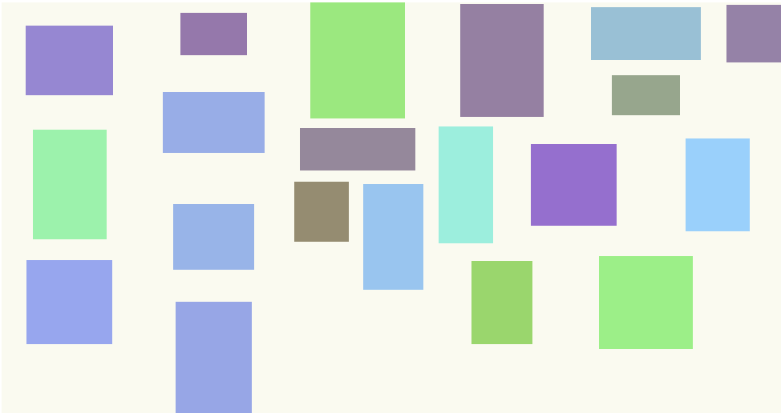

# grid
Smart CSS grid for arraging HTML elements of different sizes with a known min and max width. Scaling elements on mouse wheel also scales the grid to Keep the expected responsiveness.

# install

    >npm i scale-grid

# Live Demo

https://websvg.github.io/grid/

* reload the page to get new random size shapes
* change the window size to let the elements responsively reorganise
* shitKey+mouse wheel : scale shapes up and down together with the grid, keeping responsive reorganisation
* altKey+mouse wheel : zoom SVG element through [panzoom](https://github.com/anvaka/panzoom) library
* ctrl+mouse wheel : default browser behavior for page zoom, not recommended to be used here as elements go out of the visible area on the sides where they cannot be reached by mouse wheel
* mouse wheel : usual page vertical scroll

# Web docs
## CSS Style Sheet Constructors
* https://developer.mozilla.org/en-US/docs/Web/API/CSSStyleSheet

## CSS Grid Layout
* https://developer.mozilla.org/en-US/docs/Web/CSS/CSS_Grid_Layout

# Note on integration
* the build script is not cross os given the poor default cross platform capabilities available
* it is not necessary to recreate the wheel, in stead of re-writing a new cross platform copy script, the option of using an existing minimal bundler is being analyzed
* here some development priorization rules :
  * provide a running demo on the same repo
  * provide a ready to use file after install (optionally after build if possible to have it 100% cross platform and automated)
  * minimize file storage duplication, and keep a simple repo directory structure
  * automate the build process
  * use a budler if needed but minimize balck magic lock in and rely rather on tested standards

# Features
* SVG panzoom integration for each grid element
* enabled unlimited grid slots usage by one entry not only 1 or 2
* added element `resize()`
* press 'shift' to enable wheel grid zoom
